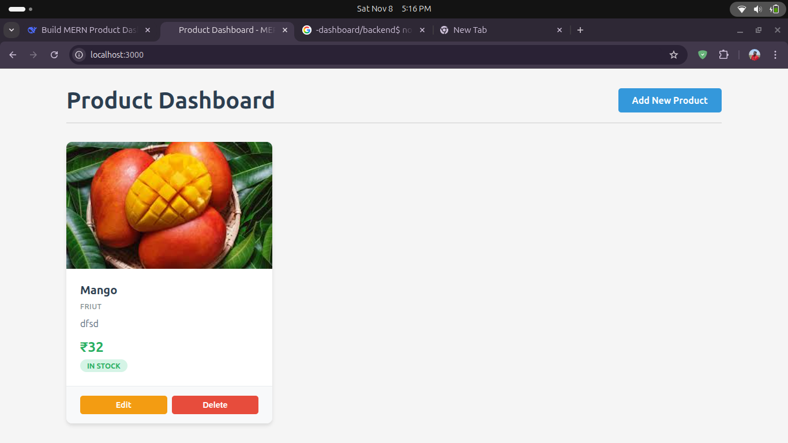
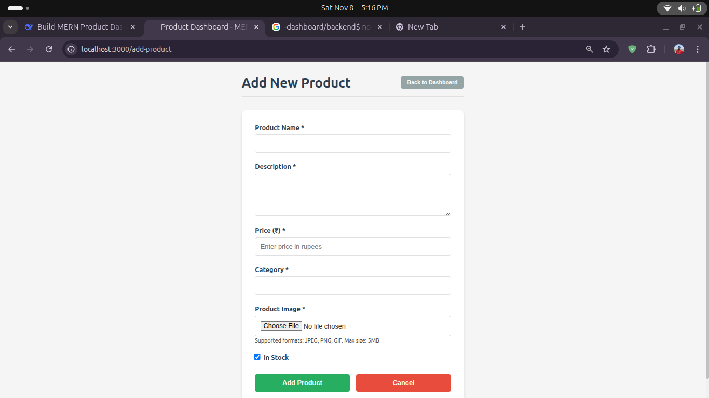

# Product Dashboard - MERN Stack

A full-stack product management dashboard built with MongoDB, Express.js, React.js, and Node.js. This application allows users to manage products with image uploads, edit product details, and view products in an elegant card-based layout.

## 🚀 Features

- ✅ **Full CRUD Operations** - Create, Read, Update, Delete products
- 🖼️ **Image Upload** - Upload product images with preview
- 💰 **Indian Currency Support** - Prices displayed in Indian Rupees (₹)
- 📱 **Responsive Design** - Works on desktop, tablet, and mobile
- 🎨 **Modern UI** - Clean and intuitive user interface
- ⚡ **Real-time Updates** - Instant updates after adding/editing products
- 🗂️ **Product Categories** - Organize products by categories
- 📦 **Stock Management** - Track product availability

## 🛠️ Tech Stack

### Frontend
- **React.js** - UI framework
- **Vite** - Build tool and dev server
- **React Router DOM** - Client-side routing
- **Axios** - HTTP client for API calls
- **CSS3** - Styling with modern features

### Backend
- **Node.js** - Runtime environment
- **Express.js** - Web framework
- **MongoDB** - NoSQL database
- **Mongoose** - MongoDB object modeling
- **Multer** - File upload middleware
- **CORS** - Cross-origin resource sharing

## 🖼️ Screenshots

### Dashboard View

### Add Product Form

### Product Dashboard

### AddProductpage

## 🚀 Quick Start

### Prerequisites
- Node.js (v14 or higher)
- MongoDB (local or Atlas)
- Git

### Installation

1. **Clone the repository**
   git clone https://github.com/AKSHAYBURUNGAL/product-dashboard.git
   cd product-dashboard

## Frontend Setup

cd frontend
npm install
npm run dev

## Backend setup

cd backend
npm install
node server.js
